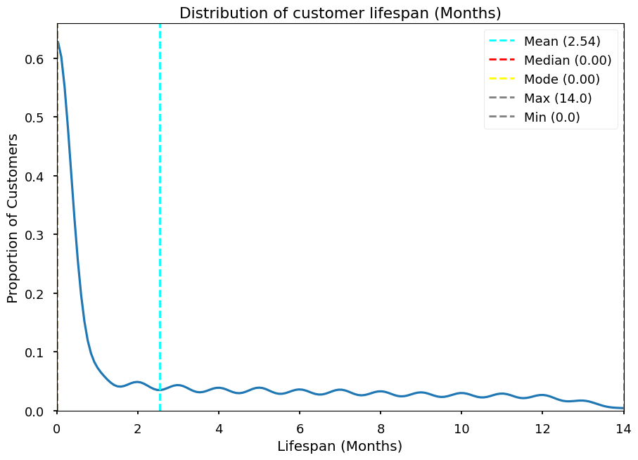
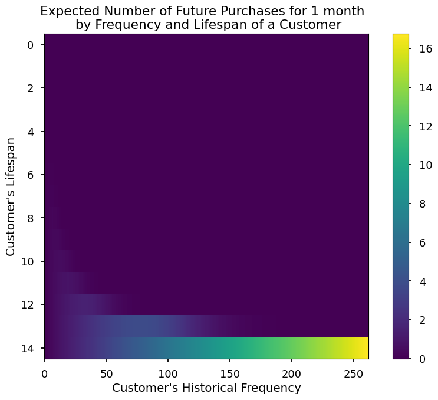
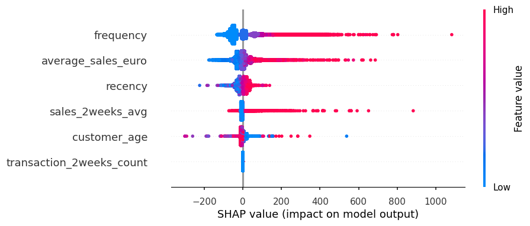
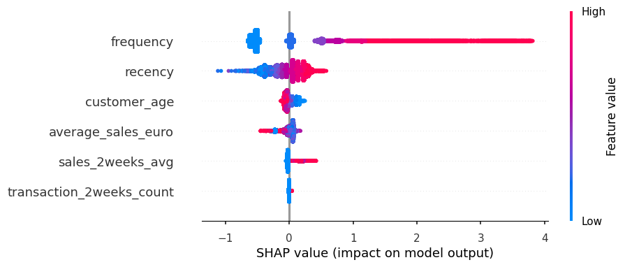

# Customer Life Value Analysis and Data Pipeline

**Customer Life Value (CLV)** is a critical metric that computes how much revenue a customer provides to a company during the Customer relationship. It is an important metric for making decisions such as how much to spend on acquring new customers and return on investment (ROI) and customer segmentation and relationship management [ [1][gartner_clv], [2][SalesCommmunication.fi] ].

The marketing team at wants to know how much can they spend on acquiring new customers to the platform. Therefore,they need CLV Analysis on an all customers for theor entire customer relation duration. The Data Analysis team was a  data pipeline where from which they can easy query the top partners by sales, Customers' favourite partner segments (default offer types) and the M1 retention for any given customer cohort.

This projoects implements the a data pipeline and the CLV analysis for the company.

## Deliverable 1: [Data pipeline][data_pipeline]

The [Data pipeline][data_pipeline] is a notebook that explores the data in the sqlite database, and answers the Analyst's questions to make life easier for the Analyst. The [Data pipeline][data_pipeline] also has a simple Data Pipeline that creates the needed presentation tables and Views in the sql database. The Analysis can further query the database via the views without having to do complex sql and joins.

Click [here (Data pipeline)][data_pipeline] to view the pipeline script

## Deliverable 2: [Customer Lifetime Value Analysis][clv_analysis]

The [Customer Lifetime Value Analysis][clv_analysis] employs descriptive, probabilistic, and predictive analysis to estimate both historical and future lifetime values of customers, providing insights for the marketing team.

Click [here (CLV Analysis)][clv_analysis] to view the notebook.


 From this Customer cohort retention chat we can infer the following:

- Retention is sustained after M1. It is crucial to reduce the drop after M0 to increase the likelihood of retaining customers for greater revenue.
- The cohort from **September 2022** (2022-09) is the most retained cohort, with retention sustained around **20%** up to M9 (the tenth month).
- There was a drop in retention in **December** for the 2022-09 and 2022-10 cohorts. In December, the 2022-09 cohort dropped by about **6%**, and the 2022-10 cohort dropped by about **3%**.
- There is a noticeable **4-7% drop** in retention during **November** across all cohorts (see diagonal from cohort 2023-10, M1 to cohort 2022-09, M14). What happens in November? The company could consider strategies such as discounted sales or special offers in October, November, and December to sustain or boost retention.
- An increase in retention is observable during the **fall months** (August, September, October). The company could capitalize on this opportunity to boost sales during these months.

---

Similar to the retention curve, the distribution of customer lifespan is right-skewed. The maximum lifespan is 14 months after the first purchase, with an average of 2.54 months.

---



- Customers who made 100 or more purchases by their 14th month with the company are likely to make 8 to 16 purchases in the following month.
- Customers who made 25 to 100 purchases recently (between months 10 and 13) are likely to make 2 to 5 purchases next month. However, we do not know the probability that these customers will be alive (with next month).

---

A regression model with XGBoot Regressor could predict the average sales for the next 90 days **with a margin of plus or minus 200 euros (MAE 200)**. The Feature Importance plot of XGBootRegressor  model is show  below



- The predicted average sales next 90 days is impacted by Frequency of puchase, average sales in the past, and recency of the purchase. More frequent buyers are with higher averages sales in the past and more recent transactions are expected to contribute to higher average sales in the next 90 days.
- Customer age and transactions in the last two weeks do not show a clear relationship with their average sales in the next 90 days.

--- 

A classification model with XGBoot Classifier could predict the probability that a customer will purchase within the next 90 days **Fwith high accuracy (AUC of 71.97 %)**. The eature Importance plot of XGBootRegressor  model is show  below.



- Frequency, recency of transactions, and customer age influence the probability of a customer making a purchase in the next 90 days.
- Older customers who have not purchased recently or have made fewer purchases in the past are less likely to make a purchase in the next 90 days. Conversely, newer customers with a high frequency of purchases and more recent transactions are more likely to make a purchase in the next 90 days.


## Setting up the project

This project uses a python virtual environment to set up all the dependencies.

To begin the setup of the virtual environment

* Install python `(version 3.12.6)`

* Install anaconda or [miniconda][minconda]

All project dependencies have been exported to a virtual environment configuration file **environment.yml**.

Create and activate the virtual environment with the command below

```bash
conda env create -f environment.yml
conda activate resq 
```

If the virtual environment is set up and activated correctly, the prompt should show
   `(resq)`

## References

* [Video, Making a case for probabilitic models][firstMarkCapital]
* [Gartner - Customer Lifetime Value (CLV): A Critical Metric for Building Strong Customer Relationships, Gartner][gartner_clv]
* [SalesCummications.fi - Customer Lifetime Value (CLV) - What is it and why is it important for a company?][SalesCommmunication.fi]
* [How to interpret cohort chart][interpret_cohort_chart]
* [Optimizing XGboots hyperparameters][xgboost_hyperparameter_optimization]

[gartner_clv]: https://www.gartner.com/en/digital-markets/insights/what-is-customer-lifetime-value
[SalesCommmunication.fi]: https://www.salescommunications.fi/vastaukset/kuinka-asiakkaan-elinkaaren-arvo-lasketaan
[minconda]: https://docs.conda.io/en/latest/miniconda.html
[interpret_cohort_chart]: https://www.adverity.com/blog/is-mastering-cohort-analysis-worth-the-challenge
[data_pipeline]: data-exploration-and-pipeline.ipynb
[clv_analysis]: customer-lifetime-value-analysis.ipynb
[firstMarkCapital]: https://www.youtube.com/watch?v=guj2gVEEx4s&ab_channel=FirstMarkCapital
[xgboost_hyperparameter_optimization]: https://medium.com/@rithpansanga/optimizing-xgboost-a-guide-to-hyperparameter-tuning-77b6e48e289d
