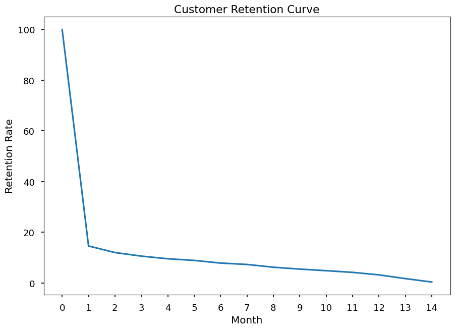
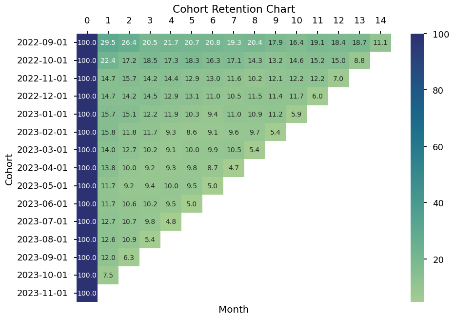

# Customer Life Value Analysis and Data Pipeline
**Customer Life Value (CLV)** is a critical metric that computes how much revenue a customer provides to a company during the Customer relationship. It is an important metric for making decisions such as how much to spend on acquring new customers and return on investment (ROI) and customer segmentation and relationship management [ [1][gartner_clv], [2][SalesCommmunication.fi] ].

The marketing team at wants to know how much can they spend on acquiring new customers to the platform. Therefore,they need CLV Analysis on an all customers for theor entire customer relation duration. The Data Analysis team was a  data pipeline where from which they can easy query the top partners by sales, Customers’ favourite partner segments (default offer types) and the M1 retention for any given customer cohort.

This projoects implements the a data pipeline and the CLV analysis for the company. 

## Deliverable 1: [Data pipeline][data_pipeline]

The [Data pipeline][data_pipeline] is a notebook that explores the data in the sqlite database, and answers the Analyst's questions to make life easier for the Analyst. The [Data pipeline][data_pipeline] also has a simple Data Pipeline that creates the needed presentation tables and Views in the sql database. The Analysis can further query the database via the views without having to do complex sql and joins. 

Click [here (Data pipeline) ][data_pipeline] to view the pipeline script

## Deliverable 2: [Customer Lifetime Value Analysis][clv_analysis]

The [Customer Lifetime Value Analysis][clv_analysis] notebook.





Click [here to view the notebook][clv_analysis]


## Setting up the project

This project uses a python virtual environment to set up all the dependencies.

To begin the setup of the virtual environment

*  Install python `(version 3.12.6)`
*  Install anaconda or [miniconda][minconda]

All project dependencies have been exported to a virtual environment configuration file **environment.yml**.

Create and activate the virtual environment with the command below

````bash 
    conda env create -f environment.yml
    conda activate resq 
````

If the virtual environment is set up and activated correctly, the prompt should show
   `(resq)`

## References

* [Video, Making a case for probabilitic models][firstMarkCapital]
* [Gartner - Customer Lifetime Value (CLV): A Critical Metric for Building Strong Customer Relationships, Gartner][gartner_clv]
* [SalesCummications.fi - Customer Lifetime Value (CLV) - What is it and why is it important for a company?][SalesCommmunication.fi]
* [How to interpret cohort chart][interpret_cohort_chart]


[gartner_clv]: https://www.gartner.com/en/digital-markets/insights/what-is-customer-lifetime-value
[SalesCommmunication.fi]: https://www.salescommunications.fi/vastaukset/kuinka-asiakkaan-elinkaaren-arvo-lasketaan
[minconda]: https://docs.conda.io/en/latest/miniconda.html
[interpret_cohort_chart]: https://www.adverity.com/blog/is-mastering-cohort-analysis-worth-the-challenge
[data_pipeline]: data-exploration-and-pipeline.ipynb
[clv_analysis]: customer-lifetime-value-analysis.ipynb
[firstMarkCapital]: https://www.youtube.com/watch?v=guj2gVEEx4s&ab_channel=FirstMarkCapital
